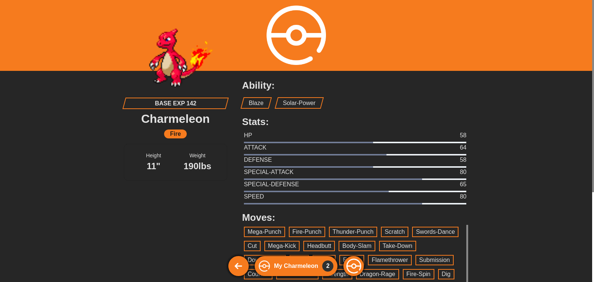
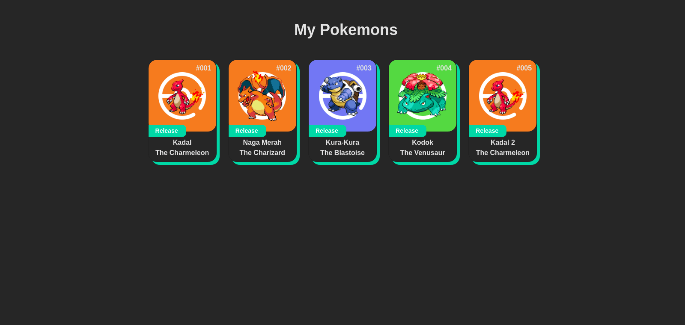

# PokeHunt

This app show a list of Pokemon, in the details page of each pokemon you can catch and collect them, you can catch the same pokemon multiple times and give unique nicknames. And you can see yout collected Pokemon on my pokemon page. This app uses data from [graphql-pokeapi](https://github.com/mazipan/graphql-pokeapi). You can check this app demo on [PokeHunt](https://poke-hunt-ts.netlify.app/).

## Preview


  



## Build Setup
In the project directory, you can run:

``` bash
# install Node Module dependencies
npm install

# serve app in the development mode with hot reload at localhost:3000
npm run start

# build for production with minification to the `build` folder
npm run build
```

## Technologies
This project uses several technologies listed below :

- **[Typescript](https://www.typescriptlang.org/)**, a strict syntactical superset of JavaScript and adds optional static typing to the language.
- **[React Context](https://reactjs.org/docs/context.html)**, context lets you “broadcast” such data, and changes to it, to all components below
- **[React Router V6](https://reactrouter.com/docs/en/v6/)**, is a collection of navigational components that compose declaratively with your application
- **[Chakra UI](https://chakra-ui.com/)**, simple, modular and accessible UI components for react applications. based on [Emotion](https://emotion.sh/docs/introduction)
- **[Apollo Client](https://chakra-ui.com/)**, is a comprehensive state management library for JavaScript that enables you to manage both local and remote data with GraphQL
